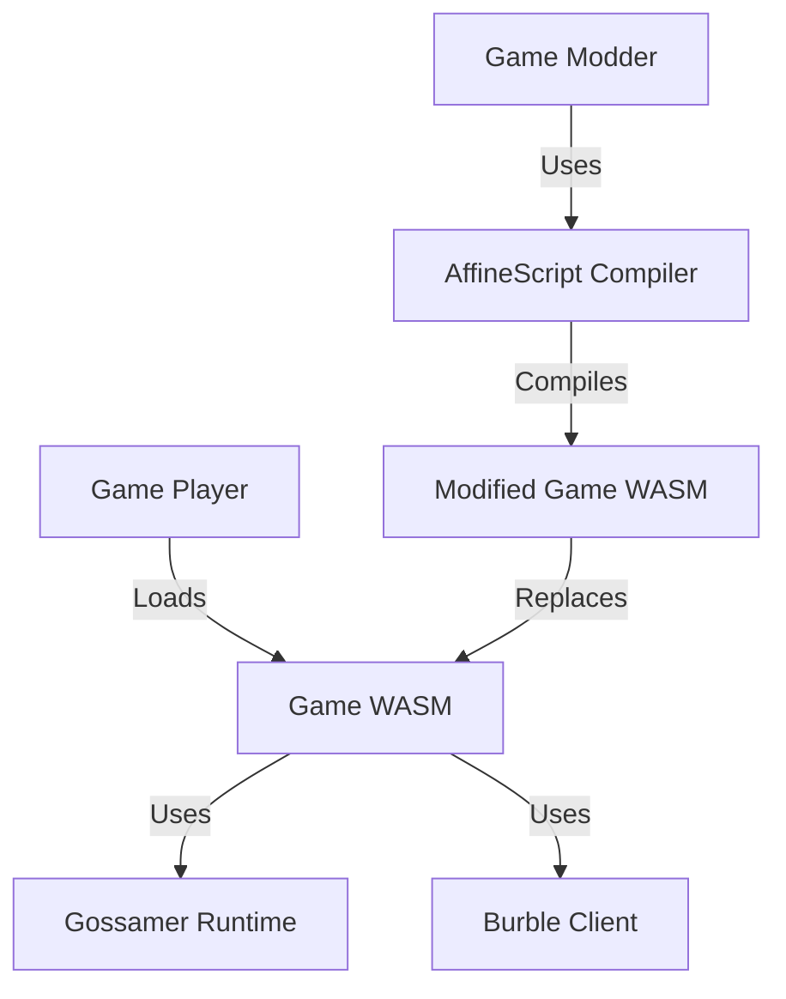

# AffineScript Game Bundling & Licensing Strategy

## 🎯 Executive Summary

**Objective:** Bundle AffineScript compilation elements into games while maintaining clear AGPL licensing for game content and PMPL licensing for core technology.

**Key Principle:** *AffineScript is required to change the game, but not to run it.*

---

## 📦 Bundling Strategy

### 1. **Stapeln Pod System for Developers**

**Architecture:**
```
Game Distribution
├── game.wasm              (AGPL-3.0-or-later - Game logic)
├── game_data/             (AGPL-3.0-or-later - Game assets)
│   ├── levels/            (AGPL-3.0-or-later)
│   ├── textures/          (AGPL-3.0-or-later)
│   ├── sounds/            (AGPL-3.0-or-later)
│   └── scripts/           (AGPL-3.0-or-later)
├── affinescript/          (PMPL-1.0-or-later - Compiler)
│   ├── compiler.wasm      (PMPL-1.0-or-later)
│   ├── stdlib/            (PMPL-1.0-or-later)
│   └── tools/             (PMPL-1.0-or-later)
├── gossamer/             (PMPL-1.0-or-later - Runtime)
│   └── runtime.wasm       (PMPL-1.0-or-later)
├── burble/               (PMPL-1.0-or-later - Voice)
│   └── client.wasm        (PMPL-1.0-or-later)
├── LICENSE-GAME          (AGPL-3.0-or-later)
├── LICENSE-TECH          (PMPL-1.0-or-later)
└── README.md             (Dual licensing explanation)
```

### 2. **Runtime vs Development Separation**

**Runtime Requirements (Players):**
- ✅ game.wasm (AGPL)
- ✅ gossamer runtime (PMPL)
- ✅ burble client (PMPL)
- ❌ affinescript compiler (not needed)

**Development Requirements (Modders):**
- ✅ All runtime components
- ✅ affinescript compiler (PMPL)
- ✅ stdlib and tools (PMPL)

### 3. **Stapeln Pod System Design**



---

## 📝 Licensing Clarification

### Current Issues
1. **README.adoc** still shows PMPL licensing for everything
2. **No clear separation** between game content and technology
3. **AGPL-3.0** file exists but not referenced for game content
4. **Dual licensing** not clearly explained

### Required Updates

#### 1. Update README.adoc
```markdown
## 🏷️ Licensing

### Game Content (AGPL-3.0-or-later)
All game-specific content including:
- Game logic and scripts
- Levels and assets
- Game data and configuration
- Example programs

**License:** GNU Affero General Public License v3.0 or later
**Purpose:** Ensure game modifications remain open
**File:** [LICENSE-AGPL-3.0](LICENSE-AGPL-3.0)

### Core Technology (PMPL-1.0-or-later)
All compiler and runtime technology including:
- AffineScript compiler
- Gossamer runtime
- Burble voice system
- Standard library
- Development tools

**License:** Palimpsest Mutual Public License 1.0 or later
**Purpose:** Permissive licensing for tooling
**File:** [LICENSE](LICENSE)

### Key Difference
- **AGPL-3.0** applies to **game content** (must remain open)
- **PMPL-1.0** applies to **technology** (can be used freely)
- **Players** only need game content (AGPL)
- **Developers** need both (AGPL + PMPL)
```

#### 2. Create LICENSE-GAME File
```bash
cp LICENSE-AGPL-3.0 LICENSE-GAME
```

#### 3. Update All Source Files
Add proper license headers:

```affinescript
// SPDX-License-Identifier: AGPL-3.0-or-later
// SPDX-FileCopyrightText: 2026 Jonathan D.A. Jewell
//
// This file is part of the AffineScript Game
//
// This program is free software: you can redistribute it and/or modify
// it under the terms of the GNU Affero General Public License as
// published by the Free Software Foundation, either version 3 of the
// License, or (at your option) any later version.
//
// This program is distributed in the hope that it will be useful,
// but WITHOUT ANY WARRANTY; without even the implied warranty of
// MERCHANTABILITY or FITNESS FOR A PARTICULAR PURPOSE. See the
// GNU Affero General Public License for more details.
//
// You should have received a copy of the GNU Affero General Public License
// along with this program. If not, see <https://www.gnu.org/licenses/>.
```

#### 4. Update Package Manifests
```json
{
  "name": "affinescript-game",
  "version": "0.1.0-alpha.1",
  "license": "AGPL-3.0-or-later",
  "dependencies": {
    "affinescript-compiler": {
      "version": "0.1.0-alpha.1",
      "license": "PMPL-1.0-or-later"
    },
    "gossamer-runtime": {
      "version": "0.1.0-alpha.1",
      "license": "PMPL-1.0-or-later"
    },
    "burble-client": {
      "version": "0.1.0-alpha.1",
      "license": "PMPL-1.0-or-later"
    }
  }
}
```

---

## 🎮 Game Distribution Model

### 1. **Player Distribution (AGPL Only)**
```
Game-Player-Package.zip
├── game.wasm              (AGPL-3.0-or-later)
├── assets/                (AGPL-3.0-or-later)
├── gossamer.wasm          (PMPL-1.0-or-later - Runtime)
├── burble.wasm            (PMPL-1.0-or-later - Voice)
├── LICENSE-GAME          (AGPL-3.0-or-later)
├── LICENSE-TECH          (PMPL-1.0-or-later)
└── README.md             (Licensing explanation)
```

### 2. **Developer Distribution (AGPL + PMPL)**
```
Game-Developer-Package.zip
├── game/                  (AGPL-3.0-or-later)
│   ├── game.wasm          (AGPL-3.0-or-later)
│   └── assets/            (AGPL-3.0-or-later)
├── tools/                 (PMPL-1.0-or-later)
│   ├── affinescript/      (PMPL-1.0-or-later)
│   │   ├── compiler.wasm  (PMPL-1.0-or-later)
│   │   ├── stdlib/        (PMPL-1.0-or-later)
│   │   └── tools/         (PMPL-1.0-or-later)
│   ├── gossamer/         (PMPL-1.0-or-later)
│   │   └── runtime.wasm   (PMPL-1.0-or-later)
│   └── burble/           (PMPL-1.0-or-later)
│       └── client.wasm    (PMPL-1.0-or-later)
├── docs/                  (Dual licensed)
│   ├── game-docs/        (AGPL-3.0-or-later)
│   └── tech-docs/        (PMPL-1.0-or-later)
├── LICENSE-GAME          (AGPL-3.0-or-later)
├── LICENSE-TECH          (PMPL-1.0-or-later)
└── README.md             (Complete licensing guide)
```

---

## 🔧 Implementation Plan

### Phase 1: Licensing Cleanup (Immediate)
- [ ] Update README.adoc with dual licensing
- [ ] Create LICENSE-GAME (copy of AGPL-3.0)
- [ ] Update all game example files with AGPL headers
- [ ] Update compiler files with PMPL headers
- [ ] Create LICENSING.md explaining the dual model
- [ ] Update package.json/stapeln.toml with proper licenses

### Phase 2: Bundling System (Alpha-1)
- [ ] Create stapeln pod structure
- [ ] Implement runtime vs dev separation
- [ ] Build automated packaging scripts
- [ ] Create distribution manifests
- [ ] Implement license verification

### Phase 3: Documentation (Alpha-1)
- [ ] Write developer licensing guide
- [ ] Create player licensing FAQ
- [ ] Update contribution guidelines
- [ ] Add license compliance checklist
- [ ] Create redistribution guide

---

## 📋 License Compliance Checklist

### For Game Distribution
- [ ] ✅ Game content licensed AGPL-3.0-or-later
- [ ] ✅ Technology licensed PMPL-1.0-or-later
- [ ] ✅ Separate LICENSE files included
- [ ] ✅ Source code available (AGPL requirement)
- [ ] ✅ Modifications tracked (AGPL requirement)
- [ ] ✅ Network use provisions documented (AGPL requirement)

### For Runtime Distribution
- [ ] ✅ Gossamer runtime included
- [ ] ✅ Burble client included
- [ ] ✅ PMPL license included
- [ ] ✅ No AGPL contamination of runtime
- [ ] ✅ Clear separation maintained

### For Development Distribution
- [ ] ✅ AffineScript compiler included
- [ ] ✅ Standard library included
- [ ] ✅ Development tools included
- [ ] ✅ Full source available
- [ ] ✅ Build scripts included

---

## 📚 Documentation Updates Required

### 1. README.adoc
```markdown
## 🎮 Game Licensing

This game uses a **dual licensing model**:

**Game Content:** AGPL-3.0-or-later
- All game logic, levels, assets, and data
- Ensures game modifications remain open source
- Required for players and developers

**Core Technology:** PMPL-1.0-or-later  
- AffineScript compiler and runtime
- Gossamer and Burble systems
- Development tools and libraries
- Permissive licensing for tooling

**Key Point:** You need the AffineScript compiler to *modify* the game, but not to *play* it.
```

### 2. LICENSING.md (New File)
```markdown
# Licensing Guide

## Dual Licensing Model

AffineScript uses a dual licensing approach to balance open game development with permissive tooling:

### AGPL-3.0-or-later (Game Content)

**Applies to:**
- Game logic and scripts
- Game levels and assets
- Game data and configuration
- Example programs and modifications

**Why AGPL?**
- Ensures game modifications remain open
- Prevents proprietary forks
- Maintains community access
- Compatible with game distribution

**Requirements:**
- Source code must be available
- Modifications must be open
- Network use must provide source
- License and copyright notices preserved

### PMPL-1.0-or-later (Core Technology)

**Applies to:**
- AffineScript compiler
- Gossamer runtime system
- Burble voice communications
- Standard library and tools
- Development infrastructure

**Why PMPL?**
- Permissive licensing for tools
- Encourages adoption
- Allows proprietary integration
- Maintains ethical use requirements

**Requirements:**
- Preserve license and copyright
- Document modifications
- No copyleft requirements
- Ethical use guidelines

## Distribution Scenarios

### Scenario 1: Player Downloads Game
**Included:** Game WASM + Assets (AGPL)
**Also Included:** Gossamer/Burble (PMPL)
**Not Included:** AffineScript compiler
**License Files:** LICENSE-GAME + LICENSE-TECH
**Compliance:** ✅ AGPL requirements met

### Scenario 2: Developer Modifies Game
**Included:** Everything from Player scenario
**Also Included:** AffineScript compiler (PMPL)
**License Files:** LICENSE-GAME + LICENSE-TECH
**Compliance:** ✅ Both licenses requirements met

### Scenario 3: Redistribute Modified Game
**Requirements:**
- Source code of modifications
- AGPL license preserved
- Original copyright notices
- Documentation of changes
- Network access to source

## Frequently Asked Questions

**Q: Do players need to open source their saves?**
A: No. AGPL applies to the game code, not player data.

**Q: Can I use AffineScript compiler in my proprietary game?**
A: Yes! The compiler is PMPL-licensed and can be used freely.

**Q: Can I sell my modified version of the game?**
A: Yes, but you must provide source code under AGPL.

**Q: Do I need to include the compiler in my game distribution?**
A: Only if you want players to modify the game.

**Q: What about the Gossamer and Burble runtimes?**
A: They're PMPL-licensed and can be distributed freely.

## Compliance Checklist

For Game Distributors:
- [ ] Include LICENSE-GAME file
- [ ] Include LICENSE-TECH file
- [ ] Provide source code access
- [ ] Document modifications
- [ ] Preserve copyright notices

For Tool Users:
- [ ] Include LICENSE-TECH file
- [ ] Preserve copyright notices
- [ ] Document modifications
- [ ] Follow ethical guidelines

## Contact

Questions about licensing? Contact:
j.d.a.jewell@open.ac.uk

Full license texts:
- AGPL-3.0: https://www.gnu.org/licenses/agpl-3.0.html
- PMPL-1.0: https://github.com/hyperpolymath/palimpsest-license
```

### 3. CONTRIBUTING.adoc
```markdown
## Licensing for Contributors

When contributing to AffineScript, please note:

**Game Content Contributions:**
- Licensed under AGPL-3.0-or-later
- Must be open source
- Modifications must be shared

**Technology Contributions:**
- Licensed under PMPL-1.0-or-later
- Permissive licensing
- Can be used in proprietary software

**Header Requirements:**
- Game files: AGPL-3.0 SPDX identifier
- Tech files: PMPL-1.0 SPDX identifier
- Always include copyright notice

**Example Game File Header:**
```affinescript
// SPDX-License-Identifier: AGPL-3.0-or-later
// SPDX-FileCopyrightText: 2026 Your Name
```

**Example Tech File Header:**
```ocaml
(* SPDX-License-Identifier: PMPL-1.0-or-later *)
(* SPDX-FileCopyrightText: 2026 Your Name *)
```
```

---

## 🏗️ Stapeln Pod Implementation

### Pod Structure
```yaml
# stapeln.toml
name: "affinescript-game"
version: "0.1.0-alpha.1"
description: "AffineScript Game with Dual Licensing"

[pods]
game = { 
  path = "game",
  license = "AGPL-3.0-or-later",
  main = "game.wasm"
}

runtime = {
  path = "runtime",
  license = "PMPL-1.0-or-later",
  components = ["gossamer", "burble"]
}

compiler = {
  path = "compiler",
  license = "PMPL-1.0-or-later",
  optional = true,
  dev_only = true
}

[licenses]
game = "LICENSE-GAME"
tech = "LICENSE-TECH"

[distribution]
player = ["game", "runtime"]
developer = ["game", "runtime", "compiler"]
```

### Build Script
```bash
#!/bin/bash
# build-pod.sh

# Build game (AGPL)
dune build --target wasm --output game.wasm

# Build runtime (PMPL)
cd gossamer && cargo build --target wasm32-unknown-unknown --release
cd ../burble && mix release

# Build compiler (PMPL - dev only)
cd affinescript && dune build --target wasm --output compiler.wasm

# Create player package
mkdir -p dist/player
tar -czf dist/player.tar.gz game.wasm assets/ gossamer.wasm burble.wasm LICENSE-GAME LICENSE-TECH README.md

# Create developer package
mkdir -p dist/developer
tar -czf dist/developer.tar.gz game/ assets/ compiler/ gossamer.wasm burble.wasm LICENSE-GAME LICENSE-TECH README.md docs/

echo "Packages created in dist/"
```

---

## 🔒 Legal Compliance

### AGPL-3.0 Requirements
1. **Source Availability:** Must provide source code
2. **Modification Sharing:** Changes must be open
3. **Network Use:** Source must be available for network access
4. **License Preservation:** AGPL license must be included
5. **Copyright Notices:** All notices must be preserved

### PMPL-1.0 Requirements
1. **License Preservation:** PMPL license must be included
2. **Copyright Notices:** All notices must be preserved
3. **Modification Documentation:** Changes must be documented
4. **Ethical Use:** Follow ethical guidelines
5. **No Copyleft:** No requirement to open source derived works

### Compliance Strategy
```
Game Distribution (AGPL):
✅ Include source code
✅ Provide LICENSE-GAME
✅ Document modifications
✅ Preserve copyrights
✅ Network access to source

Runtime Distribution (PMPL):
✅ Include LICENSE-TECH
✅ Preserve copyrights
✅ Document modifications
✅ No source requirement
✅ Ethical use compliance
```

---

## 🎯 Summary

### Key Points
1. **Dual Licensing:** AGPL for games, PMPL for technology
2. **Clear Separation:** Game content vs core tools
3. **Stapeln Pods:** Developer vs player distributions
4. **Compliance:** Separate license files and documentation
5. **Future-Proof:** Designed for game distribution

### Action Items
- [ ] Update all documentation with dual licensing
- [ ] Add proper license headers to all files
- [ ] Create separate LICENSE files
- [ ] Implement stapeln pod structure
- [ ] Build automated packaging
- [ ] Test distribution compliance

### Timeline
- **Immediate:** Licensing documentation updates
- **Alpha-1:** Stapeln pod implementation
- **Alpha-2:** Automated packaging scripts
- **Beta:** Compliance testing and validation

---

**Result:** Clear AGPL licensing for game content with PMPL licensing for core technology, enabling open game development while maintaining permissive tooling licenses.

SPDX-License-Identifier: AGPL-3.0-or-later AND PMPL-1.0-or-later
SPDX-FileCopyrightText: 2026 Jonathan D.A. Jewell