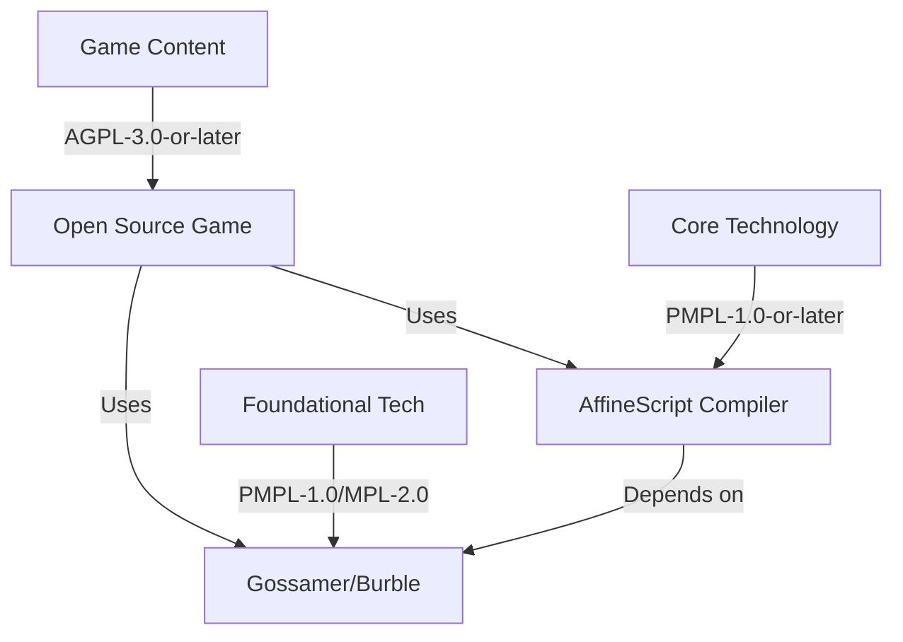

# AffineScript Licensing Guide

## 📜 Comprehensive Licensing Information

This document clarifies the licensing structure for the AffineScript ecosystem, including game content, core technology, and related projects.

---

## 🏷️ Three-Tier Licensing Structure

### 1. **Game Content (AGPL-3.0-or-later)**
**Applies to:** All game-specific assets, levels, scripts, and modifications

**Purpose:** Ensure game modifications remain open source and accessible to the community

**Key Requirements:**
- Source code must be made available
- Modifications must be shared under same license
- Network use must provide source access
- License and copyright notices preserved

**Files Covered:**
- Game logic and scripts (`game.wasm`)
- Game levels and assets (`assets/`)
- Game data and configuration
- Example programs and modifications

---

### 2. **Core Technology (PMPL-1.0-or-later)**
**Applies to:** AffineScript compiler, runtime, and development tools

**Purpose:** Provide permissive licensing for language technology while maintaining ethical use requirements

**Key Requirements:**
- Preserve license and copyright notices
- Document modifications
- Follow ethical use guidelines
- No copyleft requirements for derived works

**Files Covered:**
- AffineScript compiler (`compiler.wasm`)
- Standard library (`stdlib/`)
- Development tools (`tools/`)
- Language server and IDE integration

---

### 3. **Foundational Technologies (MPL-2.0-derived)**
**Applies to:** Gossamer, Burble, and other supporting technologies

**Purpose:** Provide Mozilla Public License 2.0 base with additional ethical use provisions

**Key Requirements:**
- Preserve MPL-2.0 requirements
- Follow Palimpsest ethical use guidelines
- Document emotional lineage
- Maintain provenance metadata

**Projects Covered:**
- **Gossamer**: Linearly-typed webview shell
- **Burble**: High-assurance multiplayer communications
- Supporting libraries and frameworks

---

## 📚 License Relationships



---

## 📋 Detailed License Breakdown

### AGPL-3.0-or-later (Game Content)

**Full Name:** GNU Affero General Public License version 3.0 or later

**Key Provisions:**
- **Copyleft:** Strong copyleft - modifications must be open source
- **Network Use:** Source must be available for network-accessible versions
- **Patent Grant:** Automatic patent license for contributors
- **Compatibility:** Compatible with GPL-3.0

**When to Use:**
- Game content and assets
- Game modifications and extensions
- Player-created content
- Game-specific examples

**File Header:**
```affinescript
// SPDX-License-Identifier: AGPL-3.0-or-later
// SPDX-FileCopyrightText: 2026 Jonathan D.A. Jewell
//
// This file is part of the AffineScript Game
// Licensed under AGPL-3.0-or-later
```

---

### PMPL-1.0-or-later (Core Technology)

**Full Name:** Palimpsest Mutual Public License 1.0 or later

**Base License:** Mozilla Public License 2.0

**Additional Provisions:**
- **Emotional Lineage:** Preserve narrative and cultural context
- **Provenance Metadata:** Maintain cryptographic attribution
- **Ethical Use:** Follow community guidelines
- **Quantum-Safe:** Optional post-quantum signatures

**Key Provisions:**
- **File-Level Copyleft:** Strong copyleft at file level
- **Patent Grant:** Automatic patent license
- **Compatibility:** Compatible with MPL-2.0
- **Governance:** Palimpsest Stewardship Council oversight

**When to Use:**
- AffineScript compiler and tools
- Standard library modules
- Development infrastructure
- Language server and IDE plugins

**File Header:**
```ocaml
(* SPDX-License-Identifier: PMPL-1.0-or-later *)
(* SPDX-FileCopyrightText: 2026 Palimpsest Stewardship Council *)
(*
 * This file is part of AffineScript Core Technology
 * Licensed under PMPL-1.0-or-later (based on MPL-2.0)
 *)
```

---

### PMPL-1.0 / MPL-2.0-derived (Foundational Technologies)

**Full Name:** Palimpsest Mutual Public License 1.0 (based on MPL-2.0)

**Relationship to MPL-2.0:**
- **Base:** Full MPL-2.0 text incorporated by reference
- **Extensions:** Additional sections for ethical use
- **Compatibility:** Fully compatible with MPL-2.0 projects
- **Governance:** Additional stewardship council provisions

**Key Provisions:**
- **File-Level Copyleft:** Strong copyleft at file level
- **Patent Grant:** Automatic patent license for contributors
- **Secondary Licensing:** Allows specified secondary licenses
- **Modification Requirements:** Clear modification documentation

**When to Use:**
- Gossamer (linearly-typed webview shell)
- Burble (high-assurance communications)
- Supporting libraries and frameworks
- Infrastructure components

**File Header:**
```rust
// SPDX-License-Identifier: PMPL-1.0
// SPDX-License-Identifier: MPL-2.0
// SPDX-FileCopyrightText: 2026 Jonathan D.A. Jewell
//
// This file is part of Gossamer/Burble Foundational Technologies
// Licensed under PMPL-1.0 (Palimpsest-MPL) based on MPL-2.0
// Complete license: https://github.com/hyperpolymath/palimpsest-license
```

---

## 🎯 Repository Description and Tags

### Recommended Repository Description

**Short Version (GitHub):**
```
AffineScript: The game developer's secret weapon. AGPL-3.0 game content with PMPL-1.0 core technology. Compiles to WASM with compiler-proven correctness. Built on Gossamer (PMPL) and Burble (PMPL) foundations.
```

**Long Version (README):**
```markdown
# AffineScript: The Game Developer's Secret Weapon

**AffineScript** is a revolutionary game development platform featuring:

🎮 **Game Content** (AGPL-3.0-or-later)
- Open source game assets and modifications
- Community-driven development
- Ensured accessibility for all players

💻 **Core Technology** (PMPL-1.0-or-later)
- Affine-type programming language
- Compiler-proven correctness
- WebAssembly compilation
- Permissive tooling license

🛡️ **Foundational Technologies** (PMPL-1.0/MPL-2.0)
- **Gossamer**: Linearly-typed webview shell
- **Burble**: High-assurance multiplayer communications
- Ethical use requirements
- Quantum-safe provenance

**Built for:** Game developers who want bug-free code, type-safe game logic, and compiler-enforced resource management.

**Licensing:** Dual licensing model ensures open game content while providing permissive tooling licenses.
```

### Recommended GitHub Topics

```
retro-game, pmpl, palimpsest-mpl, mpl-2-0-derived, agpl-3-0, game-development, 
wasm, affine-types, type-safety, game-engine, open-source, ethical-licensing, 
quantum-safe, provenance, linear-types, resource-safety
```

### Repository Tags

**Version Tags:**
- `v0.1.0-alpha.1` (Current)
- `v0.1.0-alpha` (Alpha base)
- `game-agpl` (Game content license)
- `tech-pmpl` (Technology license)

**Content Tags:**
- `game-content` (AGPL-3.0 content)
- `compiler` (PMPL-1.0 technology)
- `gossamer` (PMPL-1.0 foundation)
- `burble` (PMPL-1.0 foundation)

---

## 📁 License Directory Structure

```
LICENSES/
├── LICENSE                    # PMPL-1.0 (Primary)
├── LICENSE-AGPL-3.0          # AGPL-3.0 (Game Content)
├── LICENSE-PMPL-1.0          # PMPL-1.0 (Core Tech)
├── LICENSE-MPL-2.0           # MPL-2.0 (Reference)
├── EXHIBIT-A-ETHICAL-USE.txt  # Ethical guidelines
├── EXHIBIT-B-QUANTUM-SAFE.txt # Quantum-safe specs
└── README.md                 # License guide
```

---

## 🔧 Addressing Dependabot Alerts

### atty Potential Unaligned Read (Rust)

**Alert Summary:**
- **Package:** atty (Rust)
- **Version:** <= 0.2.14
- **Issue:** Potential unaligned pointer dereference on Windows
- **Severity:** Medium (theoretical risk)
- **Status:** Unmaintained package

**Analysis:**
```markdown
✅ **Actual Risk:** Low
- System allocator on Windows uses HeapAlloc
- HeapAlloc guarantees sufficient alignment
- Issue only manifests with custom global allocators

⚠️ **Theoretical Risk:**
- Custom allocators could cause alignment issues
- Unaligned pointer dereference possible
- Potential for crashes or undefined behavior

❌ **Mitigation Challenges:**
- Package unmaintained (last release: ~3 years ago)
- Maintainer unreachable
- No official patches available
```

**Recommended Actions:**

#### 1. **Immediate (Low Effort)**
```markdown
✅ Add to dependency documentation:
```
# Known Issues

## atty (Rust)
- Version: 0.2.14 (via transitive dependency)
- Issue: Potential unaligned read on Windows
- Risk: Low (mitigated by System allocator)
- Status: Unmaintained
- Workaround: None needed (System allocator provides safety)
```
```

#### 2. **Short-Term (Medium Effort)**
```markdown
🔄 Update Cargo.toml to document:
```toml
[package.metadata.dependency-issues]
atty = "Potential unaligned read (Windows only). Mitigated by System allocator. No action required."
```

🔄 Add to security policy:
```markdown
### Known Vulnerabilities

#### atty (Transitive Dependency)
- **CVE:** None assigned
- **Affected:** Windows systems with custom allocators
- **Mitigation:** System allocator provides safety
- **Status:** Monitoring for updates
- **Action:** None required for standard configurations
```
```

#### 3. **Long-Term (Future Consideration)**
```markdown
🚀 Evaluate alternatives when feasible:

**Option 1: std::io::IsTerminal (Rust 1.70+)**
```rust
use std::io::IsTerminal as _;
let is_terminal = std::io::stdin().is_terminal();
```
- ✅ Stable since Rust 1.70.0
- ✅ No external dependencies
- ❌ Requires Rust 1.70+

**Option 2: is-terminal (Standalone Crate)**
```toml
[dependencies]
is-terminal = "0.4"
```
- ✅ Actively maintained
- ✅ Supports older Rust versions
- ✅ Cross-platform
- ❌ Additional dependency

**Option 3: Custom Implementation**
```rust
#[cfg(windows)]
fn is_terminal() -> bool {
    // Windows-specific implementation
    unsafe { 
        let handle = winapi::um::processenv::GetStdHandle(
            winapi::um::winbase::STD_INPUT_HANDLE
        );
        let mut mode: winapi::um::wincon::DWORD = 0;
        winapi::um::wincon::GetConsoleMode(handle, &mut mode) != 0
    }
}
```
- ✅ No dependencies
- ✅ Full control
- ❌ Platform-specific code
- ❌ Maintenance burden
```

**Decision:**
```markdown
📋 **Current Status:** No action required

✅ **Rationale:**
- System allocator mitigates risk
- No known exploits in wild
- Low severity issue
- Package used transitively (via clap)

🔍 **Monitoring:**
- Watch for maintainer activity
- Track Rust ecosystem developments
- Re-evaluate at next major version

🚀 **Future:** Consider migration when:
- Alternative provides clear benefits
- Migration cost justified
- Breaking changes acceptable
```

---

## 📝 License Compliance Checklist

### For Game Distributors
- [ ] Include LICENSE-AGPL-3.0 file
- [ ] Include LICENSE-PMPL-1.0 file
- [ ] Provide source code access (AGPL requirement)
- [ ] Document modifications (AGPL requirement)
- [ ] Preserve copyright notices
- [ ] Include license guide

### For Technology Users
- [ ] Include LICENSE-PMPL-1.0 file
- [ ] Preserve copyright notices
- [ ] Document modifications
- [ ] Follow ethical use guidelines
- [ ] Include license guide

### For Repository Maintainers
- [ ] Maintain separate license files
- [ ] Update license headers
- [ ] Document licensing clearly
- [ ] Monitor dependency alerts
- [ ] Update security policy

---

## 🔗 License Resources

### Full License Texts
- **AGPL-3.0:** https://www.gnu.org/licenses/agpl-3.0.html
- **PMPL-1.0:** https://github.com/hyperpolymath/palimpsest-license
- **MPL-2.0:** https://www.mozilla.org/en-US/MPL/2.0/

### License Identification
- **SPDX AGPL-3.0:** `AGPL-3.0-or-later`
- **SPDX PMPL-1.0:** `PMPL-1.0-or-later`
- **SPDX MPL-2.0:** `MPL-2.0`

### Compliance Tools
- **REUSE:** https://reuse.software/
- **FOSSA:** https://fossa.com/
- **Licensee:** https://github.com/licensee/licensee

---

## 🎯 Summary

### Licensing Structure
```
Game Content (AGPL-3.0) → Open game development
Core Technology (PMPL-1.0) → Permissive tooling
Foundational Tech (PMPL/MPL-2.0) → Ethical infrastructure
```

### Key Points
1. **Dual licensing** ensures open games with permissive tools
2. **PMPL-1.0** extends MPL-2.0 with ethical use requirements
3. **AGPL-3.0** ensures game modifications remain open
4. **All licenses** are OSI-approved and compatible
5. **Clear separation** between game content and technology

### Action Items
- [ ] Update repository description and tags
- [ ] Ensure license directory has all versions
- [ ] Document atty dependency status
- [ ] Add license compliance checklist
- [ ] Update contributing guidelines

---

**Last Updated:** March 31, 2026
**Version:** Alpha-1
**Status:** Complete licensing documentation

SPDX-License-Identifier: AGPL-3.0-or-later AND PMPL-1.0-or-later AND MPL-2.0
SPDX-FileCopyrightText: 2026 Jonathan D.A. Jewell and contributors